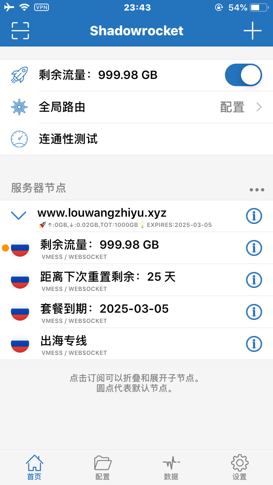

### 机场网址
https://fq.louwangzhiyu.xyz
https://ch.louwangzhiyu.xyz
https://dl.louwangzhiyu.xyz

### 客户端下载链接

#### Clash(推荐)

https://clash-verge-rev.github.io/install.html

https://github.com/louwangzhiyu007/louwangzhiyu/releases/tag/v1.7.5

#### V2rayN

V2rayN要依赖国外插件不推荐使用

https://wd.louwangzhiyu.xyz/app/v2rayN-With-Core.zip

https://github.com/2dust/v2rayN/releases/download/6.55/v2rayN-With-Core.zip

### 视频教程

#### clash

https://wd.louwangzhiyu.xyz/videos/%E6%9C%BA%E5%9C%BA%E8%AE%A2%E9%98%85%E5%8F%8A%E5%AF%BC%E5%85%A5.mp4

#### V2rayN

https://wd.louwangzhiyu.xyz/videos/V2rayN%E5%AE%A2%E6%88%B7%E7%AB%AF%E5%AF%BC%E5%85%A5%E8%AE%A2%E9%98%85.mp4

#### 安卓V2rayNG

[wd.louwangzhiyu.xyz/videos/v2rayNG导入订阅.mp4](https://wd.louwangzhiyu.xyz/videos/v2rayNG导入订阅.mp4)

#### iPhone客户端Shadowrocket

[wd.louwangzhiyu.xyz/videos/苹果手机Shadowrocket导入订阅.mp4](https://wd.louwangzhiyu.xyz/videos/苹果手机Shadowrocket导入订阅.mp4)

如打不开链接，可以查看项目images文件夹中的附件

### 订阅购买

### 订阅导入

下面的方法二选一

#### Clash

#### VrayN

双击运行把刚刚复制的订阅地址导入

在订阅分组中更新订阅

可以看到订阅成功了，这里我们要等到插件下载完成

这里选一个节点设置成活动服务器，也可以不设置 

需要翻墙的时候就把代理设置成自动配置系统代理，全局模式。

不需要翻墙的时候选清除系统代理

可以看到图标变红了，可以翻墙了。红色是正在使用代理，蓝色是没有使用代理

### 安卓手机客户端V2rayNG导入订阅

### iPhone客户端Shadowrocket导入订阅

订阅更新

